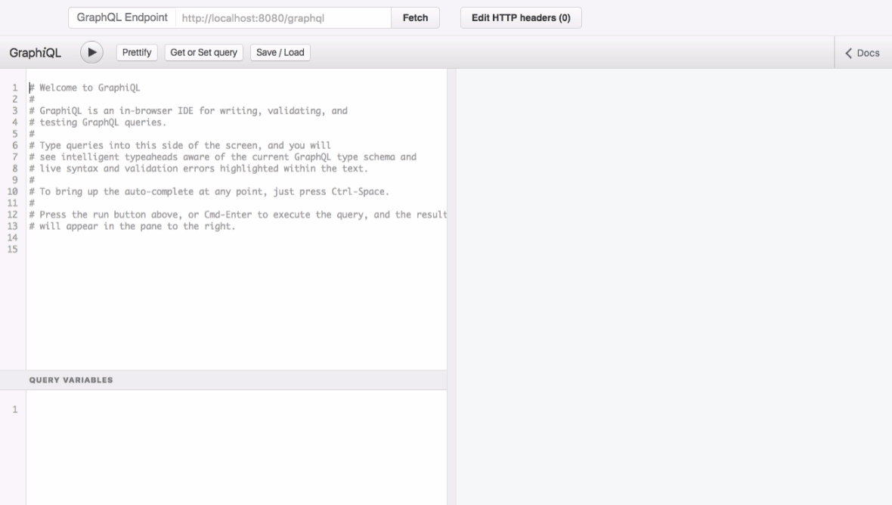
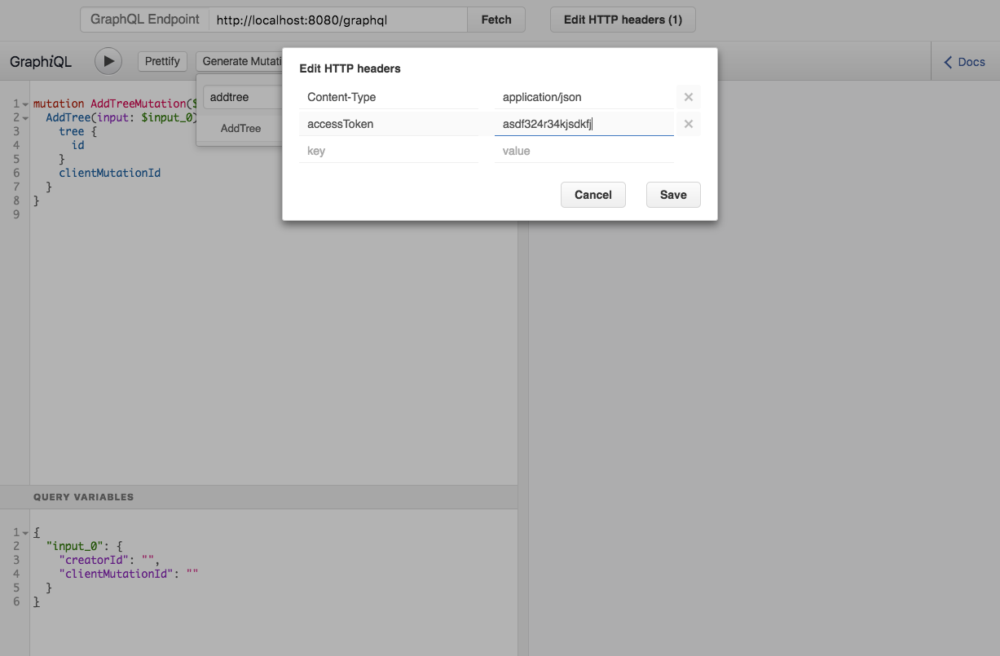

CustomGraphiQL
==============

A custom wrapper around [graphiql](https://github.com/graphql/graphiql/) package 
which offers more utility button and a component which allows to query any graphql 
endpoint. Inspired from [graphiql-app](https://github.com/skevy/graphiql-app/) 
but within browser without requirement for an app.

[](https://www.npmjs.com/package/custom-graphiql)

Try it out here: https://shahankit.github.io/custom-graphiql/





### Getting started

```sh
npm install --save custom-graphiql
# OR
yarn add custom-graphiql
```

CustomGraphiQL is React component which wraps existing GraphiQL component. It 
can be directly hosted on your server. Check the example directory for how to 
setup CustomGraphiQL on any endpoint of your express server.

Build for the web with [webpack](http://webpack.github.io/) or
[browserify](http://browserify.org/), or use the pre-bundled custom-graphiql.js 
file. See the example in the git repository to see how to use the pre-bundled 
file. Alternatively you can get custom-graphiql.js or custom-graphiql.min.js from
the [releases page](https://github.com/shahankit/custom-graphiql/releases).

Don't forget to include the CSS file on the page! If you're using npm, you can
find it in `node_modules/custom-graphiql/custom-graphiql.css`, or you can 
download it from the [releases page](https://github.com/graphql/graphiql/releases).

It can be directly hosted on your server. Check out the [example](./example) in 
thie repository for how to setup CustomGraphiQL on any endpoint of your express server.

### Features

* Generates stub mutation by scanning you schema.
* Share current query using Get or Set query button.

### Usage

CustomGraphiQL exports a single React component and it can further customized.

```js
import CustomGraphiQL from 'custom-graphiql';

<CustomGraphiQL />
```

CustomGraphiQL supports all the props and children accepted by GraphiQL **except the
`fetcher` prop**. The fetch function is implemented within the component and hence no 
fetcher props is required for CustomGraphiQL component. Check [here](https://github.com/graphql/graphiql#usage) 
for description of available props and children and their example usage.

### Contributing

1. Fork this repo by using the "Fork" button in the upper-right

2. Check out your fork

   ```sh
   git clone git@github.com:yournamehere/graphiql.git
   ```

3. Install or Update all dependencies

   ```sh
   yarn
   ```

4. Run development server

   ```sh
   yarn dev
   ```

5. Push your changes and raise a PR.
